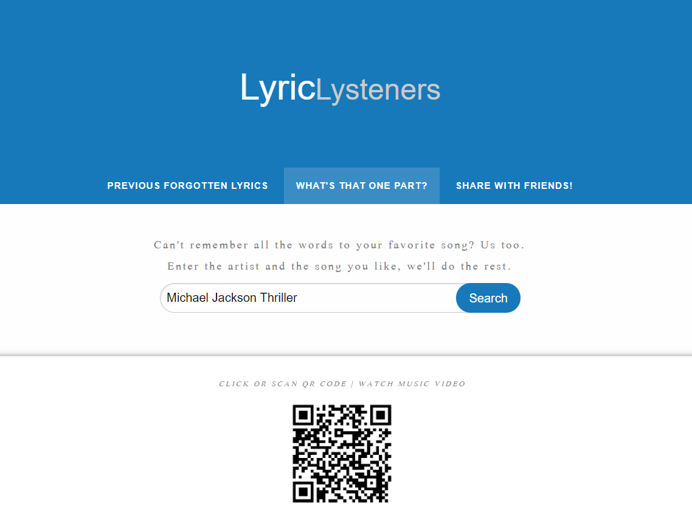

# LyricLysteners README

 

---

 

Collaborative coding project with the goal to combine two third party API's and implement them using HTML, CSS, jQuery, and Foundation. 

 

---

 

## Table of Contents
[Description](#description)

[Features](#features)

[Usage](#usage)

[Credits](#credits)

 

---

 

## Description

This is a responsive, mobile first application to help the user find song lyrics, see a music video, and share it with their friends. 

Enter the artist and song title in the search bar and then click the search button. Lyrics and a customized QR code are then generated. The QR code takes the user to the YouTube video that corresponds to the song. 

Since the website was designed mobile first we made sure the QR button was accessible for users on their phone. Therefore, the QR code is also a button and when tapped or clicked by the user it works as a link to take them to the same video. 

Go to the "Share With Friends!" tab to get the QR code for our app so you can let your friends scan it and begin using LyricLysteners too!

 

\*\* *Coming Soon* ** 
  

Go to the "Previous Forgotten Lyrics" tab to get a history list of searches you've made before. Click the text to search the lyrics again! No need for all that pesky typing!

 

---

 

## Features

* Slick design using the Foundation framework.

* Navbar to jump between our main page, share page, and history page.

* Search field to input the artist name and song title.

* Click-able "Search" button.
    * Can also simply hit "enter" on your keyboard.

* A lyric API https://happi.dev/docs/music that will retrieve lyrics based on the search input.
    * Lyrics are nicely formatted for easy reading

* A QR code API http://goqr.me/api/doc/create-qr-code/ that will generate a QR code based on the search input that takes you to the corresponding YouTube video.
    * Click-able AND scan-able "QR Code" button.

* Error message if our lyric API can't find your lyrics

* Scan-able QR code on "Share With Friends!" tab that takes your friends to our app (not click-able because you're already there silly)

* Cool looking "Previous Forgotten Lyrics" history page, though unfortunately not working yet.

 

\*\* *Note* **
* Results with our lyric API work best if you use BOTH an artist name AND a song title.
* The search field doesn't care about uppercase letters.

 

---

 

## Usage

* Make sure you are on the **"WHAT'S THAT ONE PART?" TAB** up at the top on the NAVBAR.

* Type into the **SEARCH FIELD** both the artist name and song title you wish to find. 
    * Typing in both is recommended to yield best results.

* Click the **SEARCH BUTTON** or simply press **ENTER** on your keyboard.

* View the **LYRICS**.

* Click the **QR CODE** on your own device to navigate to the corresponding **YOUTUBE** video.
    * Opens in a new tab.

* Scan the **QR CODE** to instantly bring up the video on a separate device.
    * Use the **CAMERA** on your device.
    * Bring the **CAMERA** close enough to the **QR CODE** for it to scan it.
    * A webpage **PROMPT** should appear.
    * Click on the **PROMPT** to bring up the video!

* Listen to the song on one device while looking at the lyrics on the other! Now you're LyricLystening!

Like our app?

* Click the **"SHARE WITH FRIENDS!" TAB** on the NAVBAR.
    * Find some friends.
    * Have them scan the **QR CODE** so they can enjoy this app too!

 

\*\* *Note* **
* If you search a song using the artist name AND song title and you are SURE you spelled everything correctly and the results are giving you the incorrect song or no song at all with an error message, then that is the lyric API's fault, and we are sorry. However, silver lining here, if you are getting incorrect lyrics to the song you searched you can still click or scan the QR code and it will take you to the proper YouTube page. Neat!

 

---

 

## Credits

Project Team Members:

*Front End : (HTML, CSS, Foundation)*
* Sara Wilson
* Desta Mulualem

*Back End : (HTML, jQuery, APIs)*
* Pete Scale
* Ryan Burnett

 

\* Special thanks to Josh and the gang for their help! Without you guys this app would stink! *

http://goqr.me/api/doc/create-qr-code/

https://happi.dev/docs/music

https://www.youtube.com/

https://stackoverflow.com/questions/44015476/how-to-put-error-message-into-if-statement-if/44016184

 

---